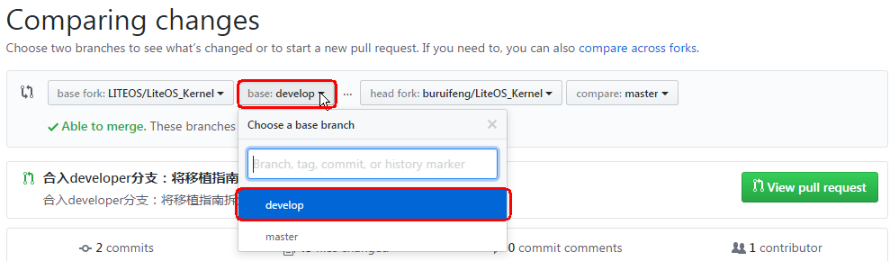

# Huawei LiteOS开源项目贡献流程
* [代码贡献流程图](#代码贡献流程图)
* [操作步骤](#操作步骤)
* [Huawei LiteOS Hackthon参赛者需要额外做一步](#Huawei-LiteOS-Hackthon参赛者需要额外做一步)

## 代码贡献流程图

## 操作步骤

1.  注册github账号，并登录网站。
  
	

2.  搜索`LITEOS/LiteOS_Kernel`项目，Fork到自己名下。传送门：[*https://github.com/LITEOS/LiteOS\_Kernel*](https://github.com/LITEOS/LiteOS_Kernel)

	

3.  在本地PC上安装Github Desktop，登录自己的github账号，Clone自己Fork的项目到本地PC。
	
	

	Clone进度条完成后，可以在本地浏览代码工程，进行修改。
	
	

4.  修改完成后，Commit到本地仓库。
	
	

5.  将本地仓库的修改内容Sync到github网站。
  
	>**注意:** github网站偶尔会卡，sync操作可能失败，尝试5次以内一般能传上去。
	
	

6.  在github网站，提交pull request到父项目的develop分支，待审核通过就OK啦。
	
	  

	>**注意:**顾名思义，请提交pull request到Huawei LiteOS项目的**develop**分支。Master分支只能由committer编辑，contributor对于master分支的pull request都会被拒绝。
	
	

## Huawei LiteOS Hackthon参赛者需要额外做一步

对于选手，需要将完成的作品工程压缩成`.rar`，在github官网上传至hackthon project

